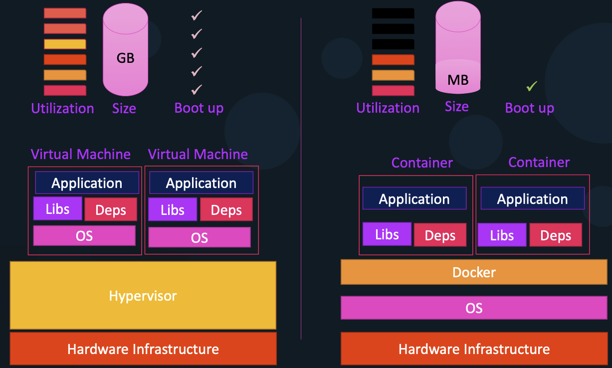

# <center>Docker Quick Guide</center>

Docker is a containerization platform that makes it easier to build, ship, and run applications. Unlike traditional virtual machines (VMs), which each include a full operating system, Docker containers share the host’s OS kernel while isolating applications.

<p align="center">
    <figure class="figure">
        <p></p>
    </figure>
</p>

This makes containers:

-   Lightweight → consume fewer resources than VMs.
-   Portable → run consistently across environments (local, staging, production, cloud).
-   Fast → start up in seconds.
-   Efficient → maximize hardware usage with less overhead.

Docker helps developers and teams by ensuring that applications always run the same way, regardless of where they’re deployed.

## Table of content

-   **[Core Concepts](#core-concepts)**
-   **[Basics](#basics)**
-   **[Running Containers](#running-containers)**
-   **[Images](#images)**
-   **[Volumes & Storage](#volumes--storage)**
-   **[Networking](#networking)**
-   **[Compose](#compose)**

## Core Concepts

Before diving into commands, it’s important to understand the key building blocks of Docker and how they interact. Docker is not just a single program—it’s a platform composed of several components working together:

-   **Docker Daemon** (dockerd) → Runs in the background and manages containers, images, networks, and storage.
-   **Docker CLI** (docker) → The command-line tool you use to interact with Docker. For example, when you type docker run ..., the CLI sends instructions to the daemon.
-   **Docker API** → A RESTful API used by the CLI and third-party tools (e.g., Portainer, Kubernetes) to communicate with the daemon.

```
+------------+        docker run ...
| Docker CLI | ------------------------+
+------------+                         |
                                       v (REST API request)
                              +------------------+
                              | Docker Daemon    |
                              | (dockerd)        |
                              +------------------+
                              | Image Management |
                              | Networking       |
                              | Containers       |
                              +------------------+

```

### Container Isolation

Docker containers share the host’s kernel but remain isolated thanks to Linux kernel features:

| Feature                            | Description                                                                      |
| ---------------------------------- | -------------------------------------------------------------------------------- |
| **Namespaces**                     | Provide isolated views of system resources.                                      |
| `pid`                              | Process tree isolation (containers have their own PIDs).                         |
| `net`                              | Separate network interfaces, IP addresses, and routing tables.                   |
| `ipc`                              | Isolate inter-process communication (semaphores, message queues, shared memory). |
| `mnt`                              | Isolated filesystem mounts.                                                      |
| `uts`                              | Separate hostname and domain name.                                               |
| `user`                             | Isolate user IDs and permissions.                                                |
| **Control Groups (cgroups)**       | Enforce resource limits (CPU, memory) and track usage.                           |
| **Union File Systems (OverlayFS)** | Provide layered images that allow efficient storage and image reuse.             |

```
    Host Machine
    -------------------------------------------------
    PID NS:      [1:init] [235:systemd] [512:sshd] ...
                \
                +--> Container
                        [1:nginx] [12:worker] ...

    NET NS:      eth0 (host)
                \
                +--> Container
                        eth0@if123 (veth pair, bridge)

    MNT NS:      / (rootfs host)
                \
                +--> Container
                        / (rootfs from image layers)
```

## Basics

| Action                            | Command                                                  |
| --------------------------------- | -------------------------------------------------------- |
| List running containers           | `docker ps`                                              |
| List all containers               | `docker ps -a`                                           |
| Inspect a container               | `docker inspect <container_name>`                        |
| View container logs               | `docker logs <container_name>`                           |
| Start a stopped container         | `docker start <container_name>`                          |
| Stop a running container          | `docker stop <container_name>`                           |
| Access a container interactively  | `docker exec -it <container_name> /bin/bash`             |
| Copy files from container to host | `docker cp <container_name>:/path/to/file /path/on/host` |
| Copy files from host to container | `docker cp /path/on/host <container_name>:/path/to/file` |
| Remove a container                | `docker rm <container_name>`                             |

## Running Containers

| Name                                | Command                                                 |
| ----------------------------------- | ------------------------------------------------------- |
| Run a container                     | `docker run <image_name>`                               |
| Run and override the command        | `docker run <image_name> <command>`                     |
| Run an interactive shell            | `docker run -it <image_name>`                           |
| Run in the background               | `docker run -d <image_name>`                            |
| Run and set an environment variable | `docker run -e COLOR=green <image_name>`                |
| Name a container                    | `docker run --name <container_name> <image_name>`       |
| Mount a volume                      | `docker run -v /host/path:/container/path <image_name>` |
| Map ports                           | `docker run -p 8080:80 <image_name>`                    |

## Images

| Name                                      | Command                                                 |
| ----------------------------------------- | ------------------------------------------------------- |
| List images                               | `docker images`                                         |
| Pull an image                             | `docker pull <image_name>`                              |
| Remove an image                           | `docker rmi <image_name>`                               |
| Save a container to a tarball             | `docker export <container_name> > <container_name>.tar` |
| Load a container from an exported tarball | `docker import <container_name>.tar`                    |
| Save an image to a tarball                | `docker save -o <image_name>.tar <image_name>:<tag>`    |
| Load an image from a tarball              | `docker load -i <image_name>.tar`                       |
| Build an image                            | `docker build -t <image_name>:<tag> -f Dockerfile .`    |
| Tag an image                              | `docker tag <image_name>:<tag> <repo>:<new_tag>`        |
| Push an image to a registry               | `docker push <image_name>:<tag>`                        |

## Volumes & Storage

Docker stores container and image data in layers.

-   Image layers are read-only and shared between containers to save space and speed up builds.
-   When a container is created, Docker adds a read-write layer on top. Any changes to files happen in this layer without modifying the original image.

There are two main types of external storage in Docker:

1. Bind Mounts :

    - Maps a specific host folder or file directly into a container.
    - Changes on the host are reflected in the container and vice versa.
    - Ideal for development environments.
    - Example: `docker run -v /host/path:/container/path myimage`

2. Volumes :

    - Storage managed by Docker and stored under Docker’s control (usually in `/var/lib/docker/volumes`).
    - Persist even if the container is removed.
    - Recommended for production or persistent data such as databases.
    - Example:

    ```bash
    docker volume create mydata
    docker run -v mydata:/container/path myimage
    ```

## Networking

Docker provides several networking options to connect containers, each suited for different use cases. By default, Docker uses network namespaces to isolate container networking.

### Default Networks

1. Bridge (default)
    - Default network for containers if no network is specified.
    - Containers can communicate with each other using container names (Docker runs a built-in DNS at 127.0.0.11).
    - Supports port mapping to the host (-p hostPort:containerPort).
    - Default subnet is usually 172.17.x.x.
2. Host
    - Container shares the host’s network stack.
    - No network isolation; port mapping is not needed.
    - Use with caution, mainly for performance-sensitive applications.
3. None
    - Container has no network interface.
    - Useful for completely isolated containers or specialized network setups.

### Custom Networks

-   You can create your own networks to isolate groups of containers or control subnets, IPs, and communication rules.
-   Docker supports multiple drivers: bridge, overlay (for swarm mode), macvlan, and host.

### Useful Commands

| Action                                | Command                                                                    |
| ------------------------------------- | -------------------------------------------------------------------------- |
| List all networks                     | `docker network ls`                                                        |
| Inspect a network                     | `docker network inspect <network_name>`                                    |
| Create a bridge network               | `docker network create --driver bridge --subnet 192.168.10.0/24 my_bridge` |
| Connect a container to a network      | `docker network connect <network_name> <container_name>`                   |
| Disconnect a container from a network | `docker network disconnect <network_name> <container_name>`                |
| Remove a network                      | `docker network rm <network_name>`                                         |

## Compose

Docker Compose allows you to define and manage multi-container applications using a single `docker-compose.yml` file.

```yaml
services:
    proxy:
        image: nginx:1.27
        container_name: proxy
        volumes:
            - ./proxy/nginx.conf:/etc/nginx/nginx.conf
            - ./proxy/reload.sh:/reload.sh:ro
        command: /bin/bash -c "apt update && apt install -y inotify-tools && nginx && bash /reload.sh"
        ports:
            - '80:80'
        networks:
            - default
        depends_on:
            mysql:
                condition: service_healthy

    mysql:
        image: mysql:8.0
        container_name: mysql
        environment:
            MYSQL_ROOT_PASSWORD: ${DB_ADMIN_PASSWORD}
            MYSQL_USER: ${DB_USER}
            MYSQL_PASSWORD: ${DB_PASSWORD}
        volumes:
            - db_data:/var/lib/mysql
            - ./database:/docker-entrypoint-initdb.d
        networks:
            - default
        healthcheck:
            test:
                [
                    'CMD-SHELL',
                    'mysqladmin ping -h localhost -u ${DB_USER} -p${DB_PASSWORD} --silent',
                ]
            interval: 10s
            retries: 5
            start_period: 30s
            timeout: 10s

volumes:
    db_data:

networks:
    default: {}
```

### Useful Compose Options

-   Keep a container interactive (good for debugging):

    ```yaml
    tty: true
    stdin_open: true
    ```

-   Build a custom image from a local Dockerfile:

    ```yaml
    build:
    context: .
    dockerfile: Dockerfile
    args:
    MY_BUILD_ARG: value
    target: dev
    ```

-   Override the container’s default startup command:

    ```yaml
    command: ['npm', 'start']
    ```

-   Override the container’s entrypoint:
    ```yaml
    entrypoint: ['bash', 'custom-entrypoint.sh']
    ```

### Common Docker Compose Commands

| Action                       | Command                            |
| ---------------------------- | ---------------------------------- |
| Create / launch all services | `docker compose up`                |
| Launch a specific service    | `docker compose up <service_name>` |
| Stop and remove all services | `docker compose down`              |
| Remove a specific service    | `docker compose rm <service_name>` |
| Remove a volume              | `docker volume rm <volume_name>`   |

### Dockerfile Example

```Dockerfile
FROM ubuntu:22.04

USER root
WORKDIR /home/app

COPY . /home/app

RUN apt update && apt upgrade -y \
    && apt install -y python3 python3-pip python3-venv \
    && python3 -m venv env \
    && env/bin/pip install --no-cache-dir -r requirements.txt

ENTRYPOINT ["python3", "app.py"]
CMD ["echo", "hello world"]
```

Notes on Dockerfiles

-   Docker uses layer caching to speed up builds by reusing unchanged layers.
-   ENTRYPOINT defines the main command that always runs when the container starts.
-   CMD provides default arguments to the ENTRYPOINT or runs if no command is specified.
-   If neither ENTRYPOINT nor CMD are defined, the container will exit immediately.
